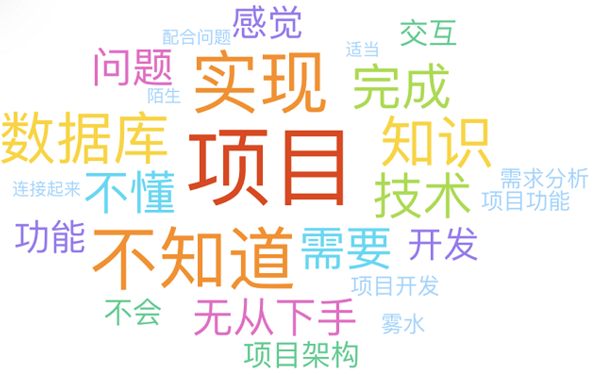
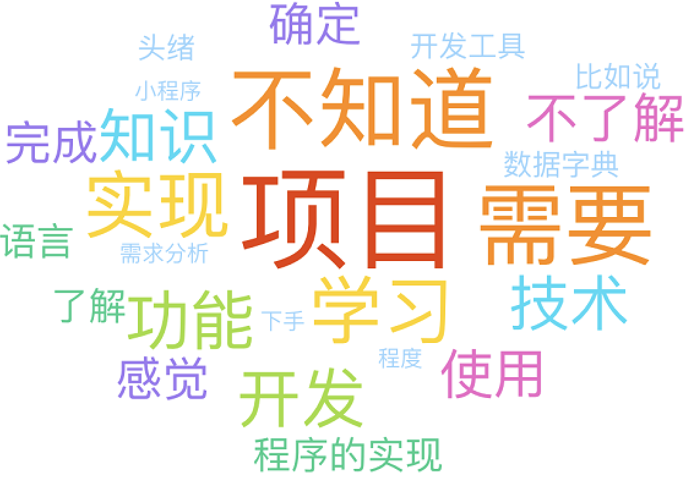

# 疑难

软五

软六

## 项目非技术问题

1. 需求分析+项目功能
   1. 课件2.2
   2. 发现一个问题➡探讨问题有没有意义➡探讨可能的解决方式➡淦
      1. 如何发现
         1. 实地调研+网络搜索
      2. 是否有意义
         1. 严重性，是不是十分干扰日常使用
         2. 普遍性，是不是只是个别少数问题
         3. 主观判断得多，数据+案例佐证
      3. 可能的解决方式（创新、特点、特色）
         1. 需要哪些功能
         2. 好不好用
         3. 创新未必是原创
         4. 逻辑自洽
2. 是否能推广，是否实用，是否会成功，可行性，能否赚￥
   1. 暂时搁置，做了再说
   2. **done is better than perfect**
   3. 能用就行
   4. 互联网+相关问题

## 技术问题

1. 需要学啥，包括但不限于框架、语言、技术、开发工具、知识、串连？
   1. 用啥学啥，干啥学啥

   2. 做好规划，各人分工，Scrum（软工核心之一）

      https://www.banlikanban.com/

      https://www.leangoo.com/

   3. 小程序

      1. 语言自带，JavaScript为主，会基础的网页设计即可
      2. 开发工具，微信小程序开发工具
      3. https://mp.weixin.qq.com/cgi-bin/wx
      4. [小程序与普通网页开发的区别](https://developers.weixin.qq.com/miniprogram/dev/framework/quickstart/#%E5%B0%8F%E7%A8%8B%E5%BA%8F%E4%B8%8E%E6%99%AE%E9%80%9A%E7%BD%91%E9%A1%B5%E5%BC%80%E5%8F%91%E7%9A%84%E5%8C%BA%E5%88%AB)
      5. 另辟蹊径，uniapp
         1. https://www.dcloud.io/
         2. https://www.zhihu.com/question/444976489
      6. 除了视频以外，从demo开始学
         1. [微信小程序demo](https://github.com/wechat-miniprogram/miniprogram-demo)

   4. 安卓

      1. 语言Java和Kotlin，可以尝试跨端例如Flutter或者RN
      2. 开发工具Java和Kotlin使用Android Studio，其他就用各自适配的
      3. 交互问题
         1. 安卓设备⬅➡服务器⬅➡数据库

   5. 网页

      1. 注册和登录，鉴权机制
      2. 交互问题
         1. 前端➡数据库？？？
         2. 前端，客户端：浏览器
         3. 后端：服务器+数据库
         4. （浏览器➡服务器）➡数据库，（浏览器⬅服务器）⬅数据库
         5. 浏览器⬅➡服务器？？？
            1. JavaScript
            2. JQuery
            3. Ajax
            4. Vue/React
         6. 服务器⬅➡数据库？？？
            1. MySQL驱动/模块/组件，举例Spring Boot的mybatis，NodeJS的mysql
            2. demo

   6. Git

      1. Gitkraken
      2. 几个小练习
         1. [commit](https://www.notion.so/Committing-Basics-Exercise-3dc1ef1873ce45e68cedd2265710d7d8)
         2. [branch](https://www.notion.so/Branching-Exercise-b5460c881d56400cb046357d9a430bf8)
         3. [merge](https://www.notion.so/Git-Merging-Exercise-0236a17f04c847159a38f5efa978ce2c)
         4. [diff](https://www.notion.so/Git-Diff-Exercise-f7829bd2783940cea14239022a6c37a9)
         5. *[stash](https://www.notion.so/Stashing-Exercise-b6b4ac460c0a4798845de177fc1eb86d)
         6. [undoing](https://www.notion.so/Undoing-Things-Exercise-d2fc1825dcc047c291a9a960848fdf71)
         7. [Github](https://www.notion.so/Github-Basics-Exercise-1c12200326db47d7890702017602d698)
         8. Github Pages

## 三不问题

1. 项目到底是什么，项目的作用有哪些
   1. 课件1.1+1.2
2. 不知道不清楚不了解，我是谁我在哪我要干什么
   1. 先解决非技术问题，再解决技术问题
3. 迷也
   1. 克服主观能动性问题

## 其他

1. 能不能傻瓜建站，可以但不推荐

   1. [上线啦](https://www.sxl.cn/)
   2. [WordPress](https://wordpress.com/zh-cn/)

2. 做不完，咋办

   1. 看情况🔨

3. 项目展示形式

   1. # Talk is cheap. Show me the code.

      1. 屁话少说，放码过来。
      2. 你的问题主要在于编码不多而想得太多。
      3. 无码说个🐔8️⃣。

   2. 视频答辩

