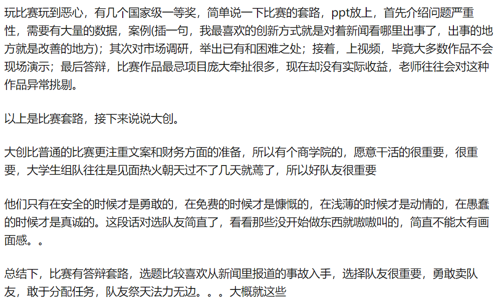

# 实验二总结

## 主要问题

1. 缺少要点

   | 要点                      | 如何描述要点                                                 |
   | ------------------------- | ------------------------------------------------------------ |
   | 项目的背景和问题          | *清晰而准确的描述出问题以及问题所处的背景、行业等，不能空乏。* |
   | 解决方案                  | *针对问题，提出有效可行的解决方案。*                         |
   | 产品、服务                | *根据方案，你所提供的有价值的产品或者服务。*                 |
   | 客户和用户画像            | *客户是出钱购买你产品或者服务的人；用户是使用你产品或者服务的人。画像简单明了描述说用户、客户的特点，通常可以借用社会共识描述，例如**28-33**岁的城市白领。客户和用户有时是相同的。* |
   | 市场分析                  | *市场有多大（注意市场是指你的产品能覆盖的空间，可以是存量和有逻辑的增量。）？目前有哪些产品或服务正在满足市场？市场的机会在哪里？* |
   | <u>**营销计划和策略**</u> | *如何保证客户选择你的产品？他们不仅要知道你的产品，还要知道如何获得，还要知道选择你的理由。策略是一个整体战略的方案集合抽象；计划是阶段性明确性的安排。* |
   | 已有基础                  | *产品、理论研究、人力资源、市场分析等等参与商业运营各要素目前已经做了哪些事？形成了哪些成果？造就了怎样的态势？* |
   | 团队情况                  | *人力资源组织情况。每个岗位都是协作机制的节点，他们由那些人负责，是否恰当？* |
   | **<u>项目特点</u>**       | 和其他同类项目相比，在解决方案、提供的产品和服务、提供的方式、团队、技术手段、商业模式要素（生产、服务、营销）等各方面有哪些不同？ 注意：如果核心的商业模式要素和别人一样，就不是特点；如果比别人还差，就没有存在的必要；描述时不能空泛，一定要简练准确明了； 项目特点往往是创新性的体现，往往是竞争优势 |
   | 盈利模式                  | 你到底挣的是什么钱？要注意几个问题： 1.一定要说清楚，挣得是什么钱？例如是产品的销售或者租金 2.不要什么钱都挣，你可以想很多，但要内聚 3.初创时还没挣到钱，这个时候论证逻辑是关键 4.能挣多少，是算出来的，不是拍脑袋出来的 5.挣的钱必须是在商业模型基础上完成的（例如：不是熟人大单偶然完成的） |
   | 财务分析                  | 初创的项目没办法财务分析，可给出合理财务假设，有逻辑链条推导，形成财务销售。 例如产品或服务定价可参考市场价，推广的数据可参考同等状况下其他项目的……，按推广计划分析 注意盈利模式和财务分析是看你的经济价值，可信可行是对价值的有效支撑。 |
   
2. 表达方式

3. PPT问题

## 互联网+相关

1. 画大饼

2. 着重突出特点

3. https://www.zhihu.com/question/310539955

   > 

4. https://zhuanlan.zhihu.com/p/69251539